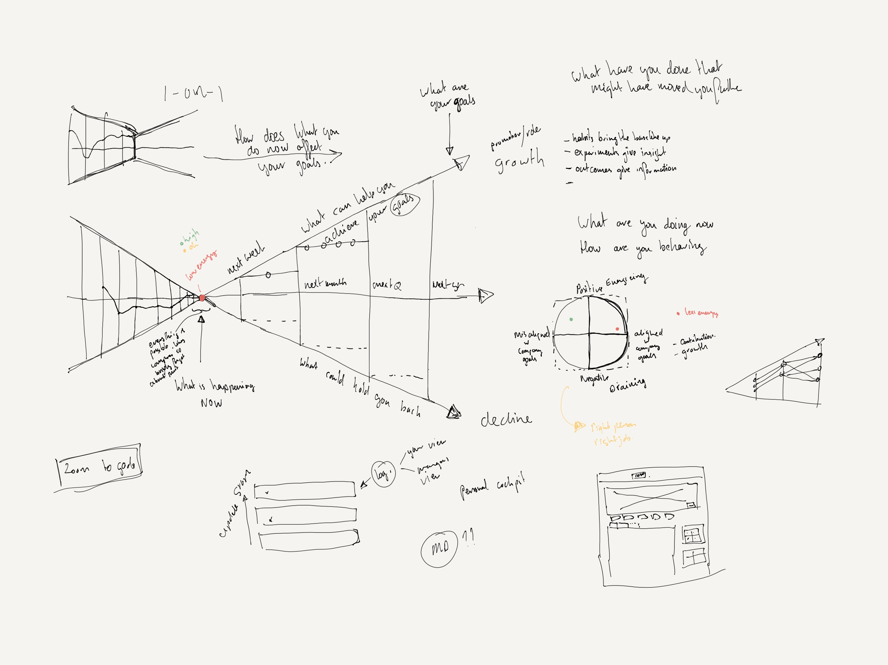
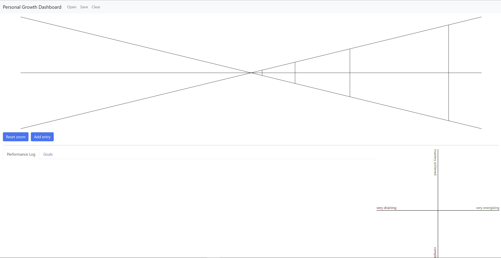
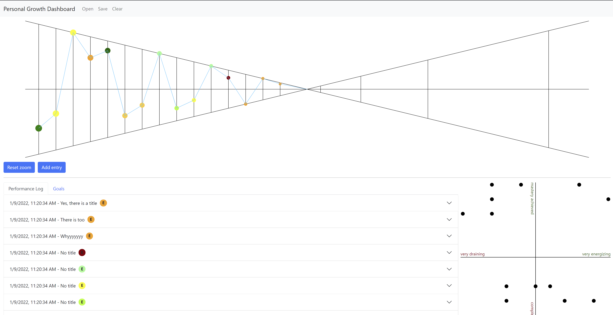
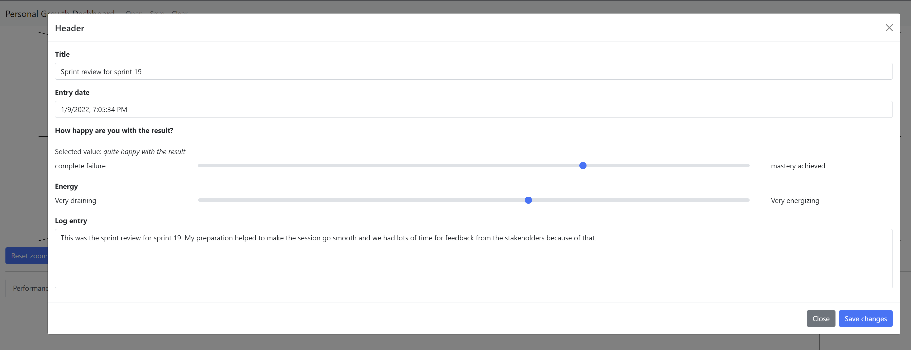

# Personal Growth graphs

This repository contains some tinkerings with D3 to visualize personal growth. A colleague got me thinking about ways to visualize what you have done, and how you plan to move ahead towards your goals.

You are free to use these tinkerings as you with without any guarantees or support :-)

Below is my initial sketch and the concept I would like to realise.



There are many ideas there that I am trying to work out as I go.

* The core concepts are (mainly in the left middle of the image):
    * Performance Log, you record things that are relevant for moving towards your goals. These can be successes, or mastery, or failures that enable learning. (left side)
    * The past performance converges to the now and are your stepping stones towards your goals
    * Your future goals exist of short-team actions and challenges
    * You can develop habits that allow you to free up mental energy to pick up new things
    * There may be risks or behaviors that you need to stap or they will keep you from your goals.
    * While you may get results and outcomes that are driving you towards your goals, that does not mean that the energize you. To see if what you are working towards and what energizes you is aligned you think about if they energize or drain you.

By recording your successes and failures in a performance log, you can show how you learn, and why you are ready for the next step.

The idea is that recording the past allows you to reflect and ask feedback.

Some of the questions behind the framework are:
* What are our next steps
* What could hold you back
* What is holding you back
* What do you want to achieve, in a year's time
* How does what you do now affect your goals
* Is what you are doing now energizing you
* Are your goals energizing you

I am still thinking about the visualization, so I might change that at some point.

# Current Status

You need to spin up some sort of simple web-server to use it.

```bash
# in the repository root:
# note this installs the npm package on your system.
npm install -g http-server
http-server src

# read the information, open index.html from the url mentioned. Probably: http://localhost:8080/index.html
```

If all goes well, you will see something like below.



You can now add new entries, or you can open the example from the repository. To do that, click "Open" in the menu up top and select `sample-data.json` from the repository root.

That will lead to something like below.



The data will be stored in your local storage, but can also be saved as a `.json` file by using "Save".

Adding and editing entries in possible. You cannot change the date of an entry right now.



The following information can be entered:
* title: the title for the entry
* entry date: the date for which the entry is, the ordering is done based on this
* outcome: how happy you are with the result or outcome
* energy: did it drain your energy or quite the opposite
* log entry: what is the entry about, what did you learn, what went well

Based on the energy, the dots in the top graph are colored. The outcome determines the height.